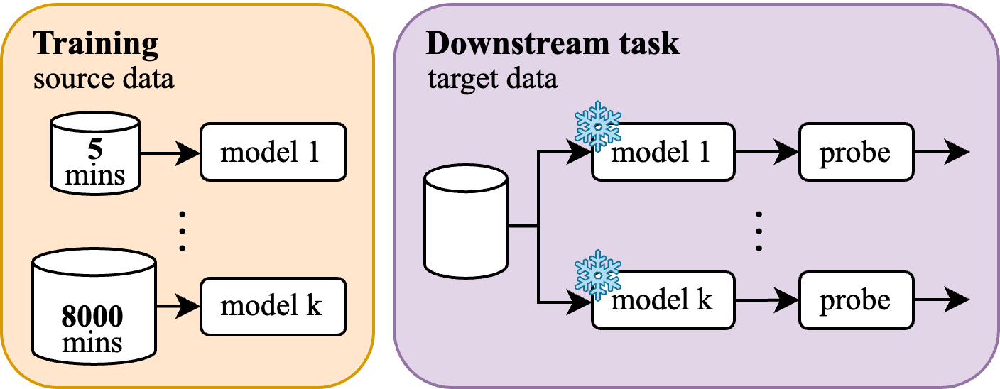

# Learning music audio representations with limited data
Code for “Learning Music Audio Representations with Limited Data”.

## Overview
***What happens when we train music audio representation models with very limited data?***



We train the following models on subsets of the MagnaTagATune music dataset, ranging from **5** to **~8000** minutes.

| Name | Architecture | Param. | Emb. Dim. | Input len. | Input feat. | Mel bins | Paradigm |
|------|--------------|--------|-------------------|--------|---------|----------|----------|
| VGGish | CNN | 3.7m | 512 | 3.75s | mel spec. | 128 | Tagging |
| MusiCNN | CNN | 12.0m | 200 | 3.00s | mel spec. | 96 | Tagging |
| AST | Transformer | 87.0m | 768 | 5.12s | mel spec. | 128 | Tagging |
| CLMR | CNN | 2.5m | 512 | 2.68s | waveform | - | SSL Contrastive |
| TMAE | Transformer | 7.2m | 256 | 4.85s | mel spec. | 96 | SSL Masked Modeling |

We extract representations from each, along with untrained models, and train downstream models on
- music tagging
- monophonic pitch detection
- monophonic instrument recognition

We show that, in certain cases,
- the representations from untrained and minimally-trained models perform comparatively to those from “fully-trained” models
- larger downstream models are able to "recover" performance from untrained and minimally-trained representations
- the inherent robustness of representations to noise is bad across the board
- the performance gap to "hand-crafted" features is still significant in pitch and instrument recognition

## Reproduction
#### 1. Requirement installation:
```bash
pip install -r requirements.txt
```

#### 2. Pretraining:
MagnaTagATune will be downloaded automatically if it's not already present in `data/MTAT`. Each model has a training script, which can be run with:
```bash
python model_name/train.py
```
where `model_name` is one of `musicnn`, `vggish`, `ast`, `clmr`, or `tmae`.

#### 3. Feature extraction
MagnaTagATune, TinySOL, and Beatport will be downloaded automatically if they're not already present in `data/`.
```bash
python extract_features.py --model model_name --task task_name
```
where `model_name` is one of `musicnn`, `vggish`, `ast`, `clmr`, or `tmae`, and `task_name` is one of `tagging`, `pitch`, or `instrument`.

#### 4. Downstream training and evaluation
```bash
python downstream.py --model model_name --task task_name
```
where `model_name` is one of `musicnn`, `vggish`, `ast`, `clmr`, or `tmae`, and `task_name` is one of `tagging`, `pitch`, or `instrument`.

#### 5. Visualization
See visualization notebooks.
