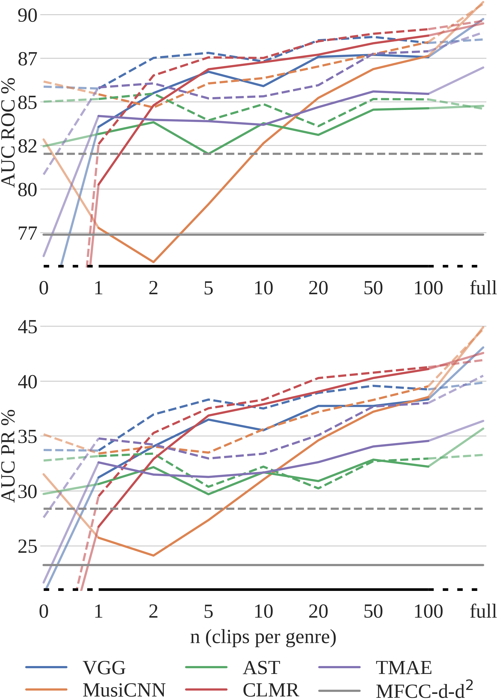
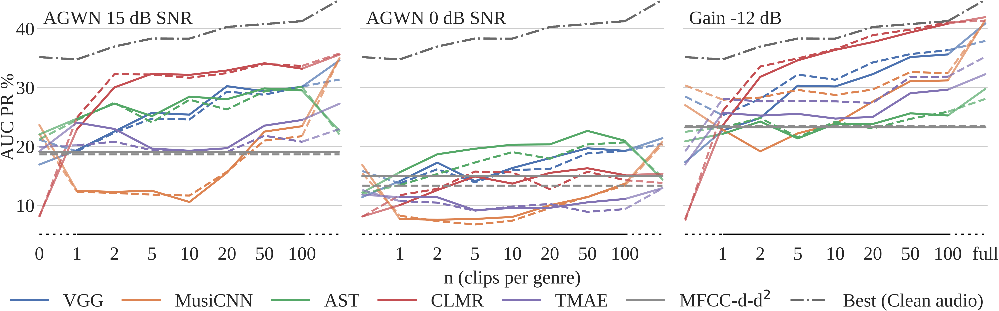
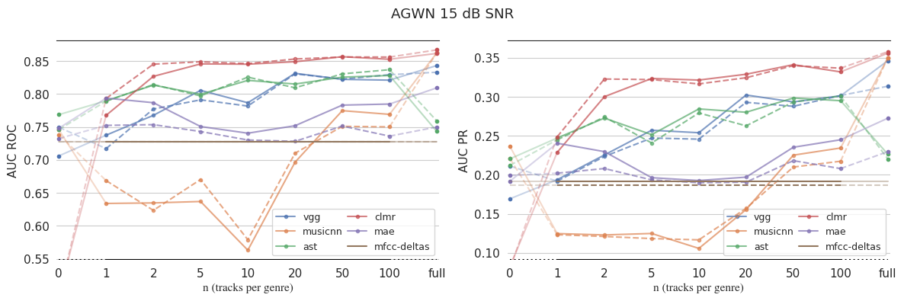
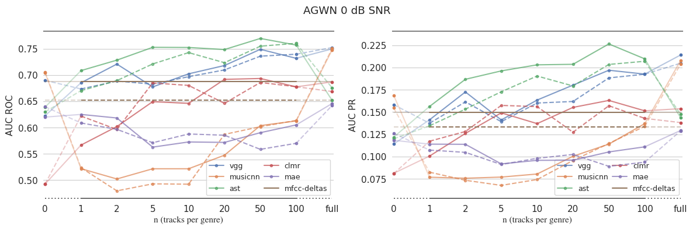
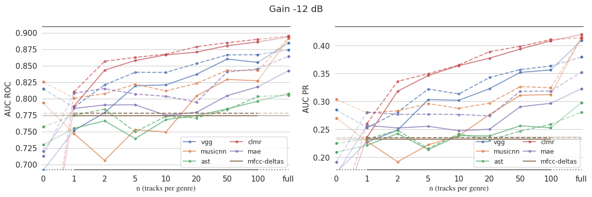
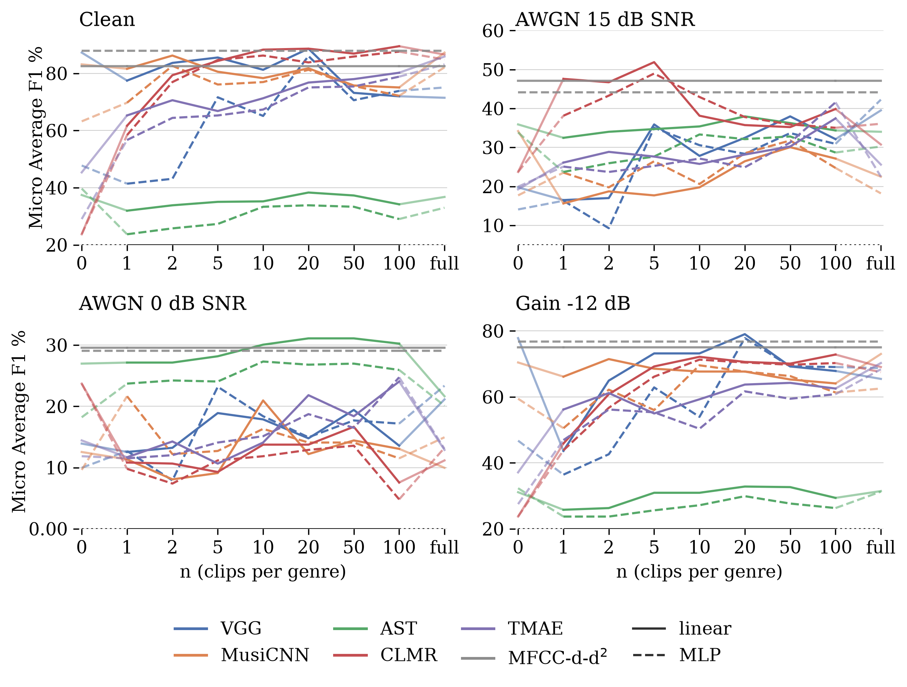
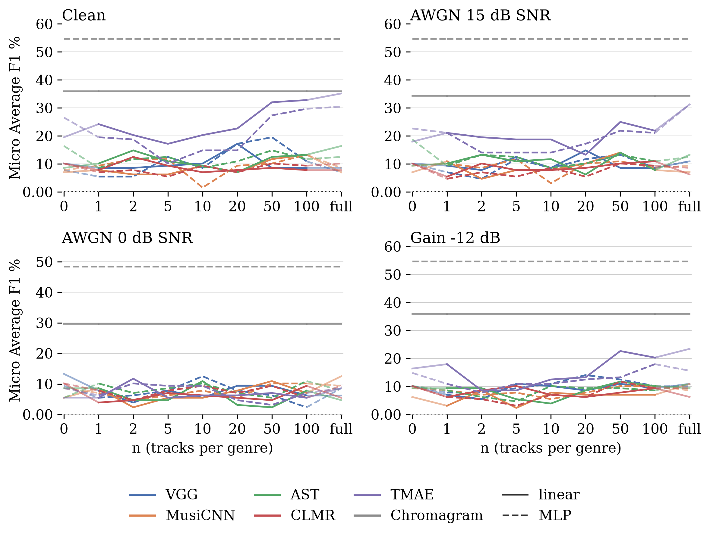

# Additional Results

In all figures, a solid line indicates the SLP was used, and a dotted line
indicates the MLP was used.

---

### MTAT Clean

### MTAT Perturbed

---

### TinySOL

---

### Beatport

